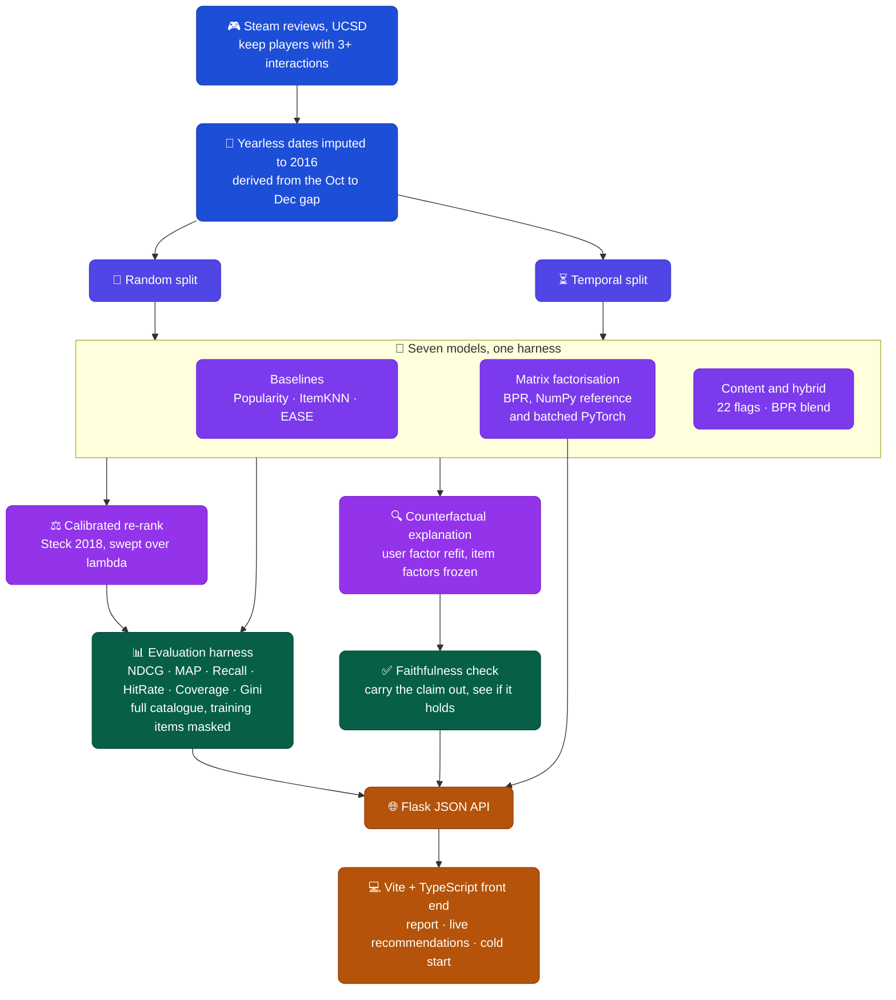

<div align="center">

# 🧭 Waypoint · Steam Game Recommender

**Seven models through one evaluation harness, and explanations that were checked rather than asserted.**

[](https://python.org)
[](https://pytorch.org)
[](https://flask.palletsprojects.com)
[](https://vitejs.dev)
[](.)
[](.)
[](https://steam-recommender-xai-eta.vercel.app/)

<br/>

*UCSD Steam reviews · 6,684 players · 2,758 games · full catalogue ranking · no sampled negatives*

</div>

---

## 🎬 Live Demo

[](https://steam-recommender-xai-eta.vercel.app/)

The app is deployed on Vercel, running the same Flask API and Vite front end described below. Open it, pick a player under Live Recommendations, and the counterfactual explanations are computed on that request, against the same trained factors the results table reports.

---

## 📖 What This Project Is

Waypoint recommends Steam games and tells you which games in your own library are holding each recommendation up. It runs seven models through a single evaluation harness so the numbers can actually be compared, and it verifies its own explanations by carrying them out instead of trusting them.

That second part is the reason the project exists in this form. A recommender that says "you might like Rust because you played Counter-Strike" is making a causal claim, and the claim is testable: remove those games, refit the user, and see whether Rust still gets recommended. Roughly half the time here, it does not. That number is in the results below rather than quietly left out.

The headline finding is not flattering. A non-personalised popularity baseline beats every personalised model on ranking accuracy while recommending about fifteen games to all 1,500 evaluated users. Reporting that was the point.

---

## 🖥️ The Application

A Flask JSON API serves a Vite and TypeScript front end, with live inference against the trained factors. The same setup runs locally or on Vercel.

Three pages. **Results** is the full evaluation report with the charts drawn from `results.json` at load time. **Live Recommendations** picks a real player from the training data and returns ten games, each with the counterfactual explanation attached. **New Player** is the cold start path, genre filtered and sentiment ranked, for someone with no history at all.

The hero renders 2,758 games as a point cloud with 6,276 edges between genuine 64 dimensional nearest neighbours, so the thing that looks like a network is the model's own similarity structure rather than decoration.

---

## ⚡ Quick Stats

<div align="center">

|  | 🏆 Best NDCG@10 | 🔍 Faithfulness | 🎮 Games | 👥 Players | 🧪 Models | ✅ Tests |
|:---:|:---:|:---:|:---:|:---:|:---:|:---:|
| **Value** | **0.1501** | **52% ±7.7%** | **2,758** | **6,684** | **7** | **29** |

*The best score belongs to the popularity baseline, not to anything personalised.*

</div>

---

## 🗃️ Dataset

<div align="center">

| Detail | Value |
|:---|:---|
| 📚 Source | UCSD Steam review data |
| 👥 Players (3 or more interactions) | 6,684 |
| 🎮 Games | 2,758 |
| 🔗 Interactions | 31,799 |
| 🕳️ Density | 0.17% |
| ✂️ Splits | Random and temporal, both evaluated |
| 👤 Evaluation cohort | 1,500 users, shared by every model |
| 🎲 Seeds | 3, with 95% intervals on the stochastic models |

</div>

Steam stamps a posting date on every review (`Posted November 5, 2011.`), except for reviews written in the year the data was scraped, which drop the year (`Posted June 24.`). Those need a year before a temporal split means anything.

The year is 2016, and it is derived rather than guessed. Yearless reviews run from January to September and are exactly zero from October to December, while 2015 is populated in all twelve months. That gap places the scrape in September 2016. Picking 2015 instead would have scattered 17% of the data into the middle of the timeline and corrupted the temporal split without ever throwing an error.

---

## 🧠 How It Works



<div align="center">

| Component | Detail |
|:---|:---|
| 🥇 Ranking protocol | Full catalogue with training items masked |
| 📏 Metrics | NDCG, MAP, Recall, HitRate at 10, plus Coverage and Gini |
| 🧮 BPR | Two implementations, NumPy reference and batched PyTorch, checked against each other |
| ⚙️ BPR training | 50 epochs, per batch L2 on gathered embeddings |
| 🧊 EASE | Closed form shallow autoencoder (Steck 2019) |
| ⚖️ Calibration | Steck (2018) re-ranking with KL miscalibration, swept over five lambda values |
| 🔍 Explanation | Counterfactual removal with user factor refitting, minimal set search after ACCENT |
| 🎯 Faithfulness | 150 explanations verified by actually performing the removal |

</div>

---

## 📊 Evaluation Results

Full catalogue ranking, one 1,500 player cohort shared by every model, 3 seeds with 95% intervals on the stochastic ones. Coverage and Gini are from the random split.

<div align="center">

| Model | NDCG@10 (random) | NDCG@10 (temporal) | Coverage | Gini |
|:---|:---:|:---:|:---:|:---:|
| 🥇 Popularity | **0.1501** | **0.0858** | 0.0054 | 0.9961 |
| EASE | 0.1474 | 0.0708 | 0.2491 | 0.9732 |
| BPR | 0.1297 ±0.0078 | 0.0587 ±0.0029 | 0.4503 | 0.9304 |
| Hybrid | 0.1253 ±0.0096 | 0.0560 ±0.0058 | 0.4686 | 0.9248 |
| ItemKNN | 0.0869 | 0.0458 | **0.7643** | **0.6857** |
| Calibrated (λ=0.5) | 0.0769 | 0.0441 | 0.4793 | 0.9146 |
| Content only | 0.0107 | 0.0072 | 0.7281 | 0.7596 |

</div>

**A non-personalised baseline wins.** Popularity takes the top NDCG while covering 0.54% of the catalogue at a Gini of 0.996, which is roughly the same fifteen games shown to all 1,500 players. Judged on accuracy alone this project would have declared success for the least useful system it built. Coverage and Gini sit in the same table for that reason.

**The hybrid does not beat plain BPR.** 0.1253 against 0.1297, intervals overlapping. The content component scores 0.0107 by itself, so blending it in mostly adds noise. Twenty two hand picked genre and tag flags do not carry enough signal to help.

**Where the original 0.5203 went.** An earlier version of this project reported 0.5203. Same data, same model, two protocols:

<div align="center">

| Protocol | NDCG@10 |
|:---|:---:|
| 99 sampled negatives | 0.4951 |
| Full catalogue | 0.1266 |

</div>

That is 3.91x of inflation. Together with an IDCG bug it accounts for essentially all of the original figure. Moving from a random to a temporal split costs roughly another half, and it costs the personalised models more than Popularity (−54.7% against −42.8%), which is what should happen once a random split stops leaking a player's future into training.

**Calibration trade-off**, swept over λ. This sweep runs on the first 300 players of the cohort rather than all 1,500, so its coverage and NDCG are not directly comparable to the table above:

<div align="center">

| λ | NDCG@10 | KL miscalibration | Coverage |
|:---:|:---:|:---:|:---:|
| 0.00 | 0.1054 | 1.1123 | 0.1831 |
| 0.25 | 0.0873 | 0.5454 | 0.1885 |
| 0.50 | 0.0718 | 0.2679 | 0.1958 |
| 0.75 | 0.0564 | 0.0756 | 0.2016 |
| 1.00 | 0.0415 | 0.0378 | 0.1933 |

</div>

**BPR parity.** NumPy 0.1430 against PyTorch 0.1297 ±0.0078. Inside the 0.02 absolute tolerance the check uses, though the NumPy reference is genuinely a little ahead rather than the two landing identical.

---

## 🔍 What the Explanations Look Like

Each recommendation names the games in the player's own library that hold it up, found by removing candidates and refitting the player's latent vector with item factors held fixed.

<details>
<summary>🎯 Rust</summary>

```
Rust was recommended because you played Counter-Strike: Global Offensive,
Ryse: Son of Rome and XCOM: Enemy Unknown.
```
</details>

<details>
<summary>🎯 Left 4 Dead 2</summary>

```
Left 4 Dead 2 was recommended because you played Team Fortress 2
and Five Nights at Freddy's 2.
```
</details>

<details>
<summary>🎯 DayZ</summary>

```
DayZ was recommended because you played Day of Defeat: Source
and Garry's Mod.
```
</details>

<details>
<summary>🎯 Borderlands 2</summary>

```
Borderlands 2 was recommended because you played XCOM® 2
and Team Fortress 2.
```
</details>

<details>
<summary>🎯 Garry's Mod</summary>

```
Garry's Mod was recommended because you played
Counter-Strike: Global Offensive.
```
</details>

<br/>

> **Faithfulness: 52.0% ±7.7%** across 150 checked explanations. About half of these claims survive being carried out. Raising the user factor refit from 400 steps to 3,000 does not move the number (64%, 60%, 63% on the samples tested), so this is a property of the explanations themselves and not an under converged refit. Half is a poor score and it is reported because it is the measured one.

---

## 🧹 What This Replaced

The first version of this project had three flaws worth naming, because fixing them is most of what the current version is.

**The headline metric measured the wrong model.** The evaluation loop scored plain BPR while the output was labelled "hybrid recommender", so the content blend and both fairness re-rankers were never measured for ranking accuracy at all. There were no baselines either, which left the number uninterpretable even on its own terms.

**The explanations explained a model that played no part in ranking.** SHAP and LIME were applied to a RandomForest trained on 22 item attributes with no user representation anywhere in it. It could not answer "why was this recommended to *me*", having no notion of a user. That analysis is still here, relabelled as what it actually is: a catalogue level attribute study.

**The app claimed to be interactive and was not.** It read two numbers from a JSON file and displayed stored images. The cold start method the copy advertised was never called by anything.

---

## 📁 Project Structure

```
waypoint/
├── 🚀 train.py                    full pipeline: download, train, evaluate, write results.json
├── 🌐 app.py                      Flask JSON API and static host for the built front end
├── 📄 requirements.txt
│
├── 📂 core/
│   ├── data.py                    download, parse, filter, encode, features, both splits
│   ├── recommender.py             NumPy BPR reference plus hybrid, fair, diverse, cold start
│   ├── recommender_torch.py       batched PyTorch BPR, faster and differentiable
│   ├── baselines.py               Popularity, ItemKNN, EASE
│   ├── evaluation.py              shared harness: NDCG, MAP, Recall, HitRate, Coverage, Gini
│   ├── calibration.py             Steck 2018 calibrated re-ranking and KL miscalibration
│   ├── explain.py                 counterfactual explanation and faithfulness scoring
│   ├── persistence.py             saves and loads factors so the app can serve live inference
│   ├── xai.py                     catalogue level attribute analysis (SHAP and LIME)
│   ├── bias.py                    popularity bias measurement and mitigations
│   └── plotstyle.py               dark matplotlib theme for the generated figures
│
├── 📂 frontend/src/
│   ├── main.ts                    router and bootstrap
│   ├── brand/logo.ts              the Waypoint mark, one path
│   ├── hero/cloud.ts              WebGL2 point cloud and neighbour network
│   ├── background/field.ts        parallax starfield behind the page
│   ├── charts/                    scatter, bars, slope, calibration, pipeline flow
│   ├── pages/                     report, recommend, coldstart
│   └── styles/                    tokens and base
│
├── 📂 tests/                      29 tests: metrics, calibration, torch parity, layout
└── 📂 static/                     13 generated figures and the embedding projection
```

> The `core/` grouping above is for reading. The modules currently sit at the repository root next to `train.py` and `app.py`.

---

## ⚙️ How to Run

**1. Clone and install**
```bash
git clone https://github.com/abinashprasana/steam-recommender-xai.git
cd steam-recommender-xai
pip install -r requirements.txt
```

`requirements.txt` is deliberately just what `app.py` needs to serve a request: Flask, numpy, pandas, scipy, scikit-learn, joblib, tqdm. Training, the generated figures and the test suite need more on top (matplotlib, shap, lime, torch, pytest):

```bash
pip install -r requirements-train.txt
```

**2. Build the front end**
```bash
npm --prefix frontend install && npm --prefix frontend run build
```

This step is not optional. Flask serves a built bundle, so skipping it leaves `frontend/dist/` empty and `python app.py` answers 503 with a note saying exactly that, rather than failing silently.

**3. Train and evaluate**
```bash
python train.py
```

Downloads the data on first run, trains every model, writes `results.json` and the figures.

**4. Serve**
```bash
python app.py
```

Then open `http://localhost:5000`.

<details>
<summary>⚙️ Useful flags and individual steps</summary>

```bash
# more seeds and a larger evaluation cohort
python train.py --seeds 5 --eval-users 2000

# smoke test: skips calibration, XAI and bias
python train.py --quick --seeds 1

# tests
python -m pytest tests/ -q
```
</details>

---

## ⚠️ Limitations

This is a portfolio project on a small dataset, and several results should be read with that in mind.

The interaction matrix is 0.17% dense across 6,684 players and 2,758 games, which is thin enough that a popularity baseline is genuinely hard to beat. That is a real property of the data, not only of the models. The content signal comes from 22 hand picked genre and tag flags, and at 0.0107 NDCG it barely functions on its own, which is why the hybrid gains nothing from it.

Explanation faithfulness at 52% is the weakest number here. The counterfactual search finds a minimal set that changes the ranking under refitting, but roughly half the time the claim does not reproduce, and the refit budget is not the cause. Ranking is implicit feedback only, so a review means interaction rather than enjoyment, and nothing distinguishes a game someone loved from one they refunded.

<div align="center">

| 🔧 Possible improvement | 📈 Expected effect |
|:---|:---|
| Learned item embeddings instead of 22 flags | Content component that contributes rather than adds noise |
| Sequence model (SASRec, GRU4Rec) | Uses interaction order, which the temporal split rewards |
| Playtime or review sentiment as signal | Separates enjoyed from merely owned |
| Larger catalogue and longer history | Weakens the popularity baseline's advantage |
| Wider faithfulness sweep across explainers | Shows whether 52% is this method or the whole approach |

</div>

---

## 📚 References

- Steck, *Calibrated Recommendations*, RecSys 2018
- Steck, *Embarrassingly Shallow Autoencoders for Sparse Data*, WWW 2019
- Tran et al., *Counterfactual Explanations for Neural Recommenders*, SIGIR 2021
- Koh and Liang, *Understanding Black-box Predictions via Influence Functions*, ICML 2017
- Hidasi and Czapp, *Widespread Flaws in Offline Evaluation of Recommender Systems*, RecSys 2023

---

## 👤 Author

**Abinash Prasana Selvanathan**

*If you found this useful, feel free to ⭐ star the repo.*
